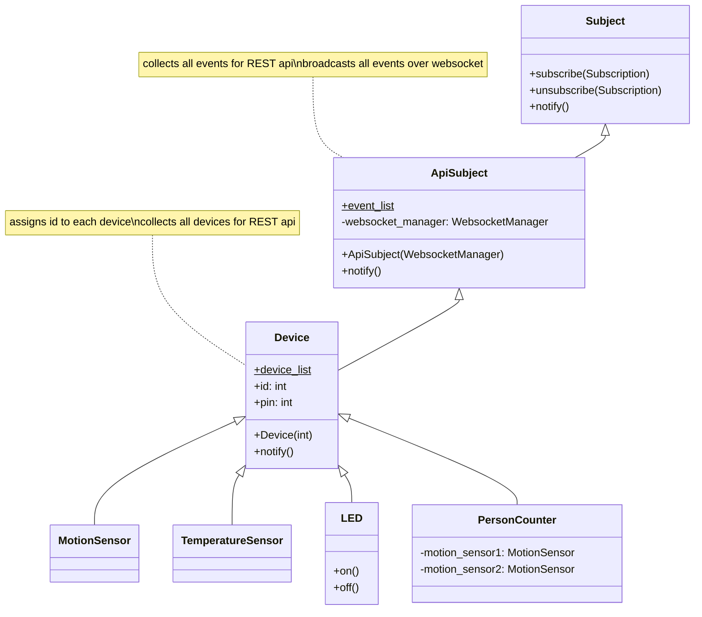

# Serverraumueberwachung

## Getting Started

- Install the requirements
  - fastapi
  - uvicorn
  - gpiozero
  - adafruit-circuitpython-dht
- Start the Application (Dev): `python -m uvicorn main:app --reload`
- open the [Dashboard](https://buntelrus.github.io/Serverraumueberwachung/settings) and configure your fastapi connection

## Helpful resources

- [GPIO-Pin-Doc](https://pinout.xyz/)

## Vererbung

The following diagram shows, how the programm processes the data to feed our dashboard.

